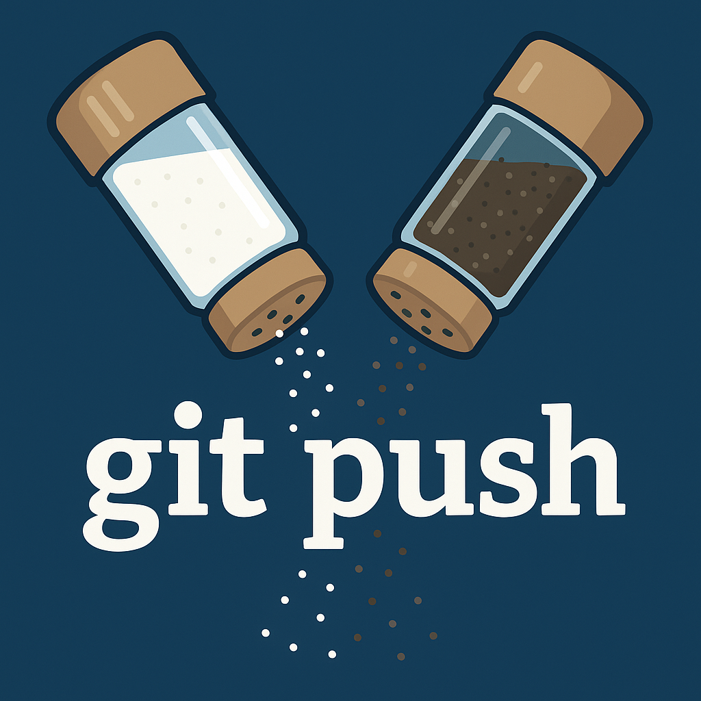

# Git up on this!

**Spice up your workflow** – every time you `git push`, this extension drops a random 5-second clip of Salt-N-Pepa's *Push It*. You're not just pushing code—you're pushing vibes.



---

## Features

* **Command**: `git-music push`
  Runs `git push` in a terminal and plays a random clip from `push-it.mp3`
* Uses `ffplay` from FFmpeg for audio playback
* Works on macOS, Linux, and Windows

---

## Requirements

You must have [FFmpeg](https://ffmpeg.org/download.html) installed and available in your system's `PATH`.

To check:

```bash
ffplay -version
```

Install with:

* **macOS**: `brew install ffmpeg`
* **Ubuntu**: `sudo apt install ffmpeg`
* **Windows**: [Download FFmpeg](https://ffmpeg.org/download.html) and add it to your system PATH

---

## Usage

Open the Command Palette (`Ctrl+Shift+P` on Windows/Linux, `Cmd+Shift+P` on macOS) and run:

```
git-music push
```

This will:

1. Open a terminal
2. Execute `git push`
3. Play a random 5-second audio clip

---

## Extension Settings

*None yet.* Just plug and push.

---

## Known Issues

* If `ffplay` isn't installed or is missing from your `PATH`, the sound won't play.
* Does not trigger automatically from Git UI or terminal—only via the `git-music push` command.

---

## Release Notes

### 1.0.0

* Initial drop: `git-music push` command with random audio clip playback

---

## License Note

This extension includes a short audio clip for fun and personal use only. You are responsible for ensuring you comply with all relevant copyright laws.

---

**Now go ahead—git up on this!** 🎤💻🔥
